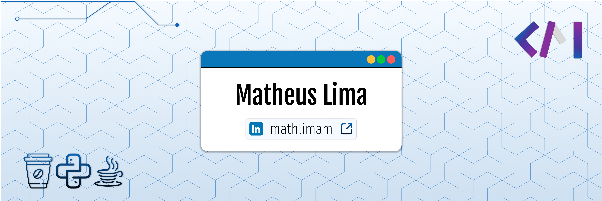

## Contact 

&nbsp;

## About me

🚀 &nbsp;BackEnd/Fullstack Developer | Transforming Challenges into Efficient Solutions  
🌍 &nbsp;Based in Feira de Santana, BA, Brazil  
🧠 &nbsp;Experienced in HR, Finance, and Team Management within Construction and Industrial Maintenance sectors  
💡 &nbsp;Transitioning to Tech with a focus on Software Development and Project Management  

### Goals

- 📈 &nbsp;Contribute to innovative projects that impact businesses and people positively.
- 💻 &nbsp;Develop scalable, efficient, and user-centric software solutions.
- 🤝 &nbsp;Leverage my strategic vision and leadership skills in dynamic and collaborative teams.

## Statistics

   
  
  

 
 

  

## My Skills

#### Languages & Frameworks
&nbsp;
&nbsp;
&nbsp;
&nbsp;
&nbsp;
&nbsp;
&nbsp;
&nbsp;
&nbsp;

#### Databases
&nbsp;
&nbsp;
&nbsp;
&nbsp;
&nbsp;

#### Tools
&nbsp;
&nbsp;
&nbsp;
&nbsp;
&nbsp;
&nbsp;
&nbsp;

